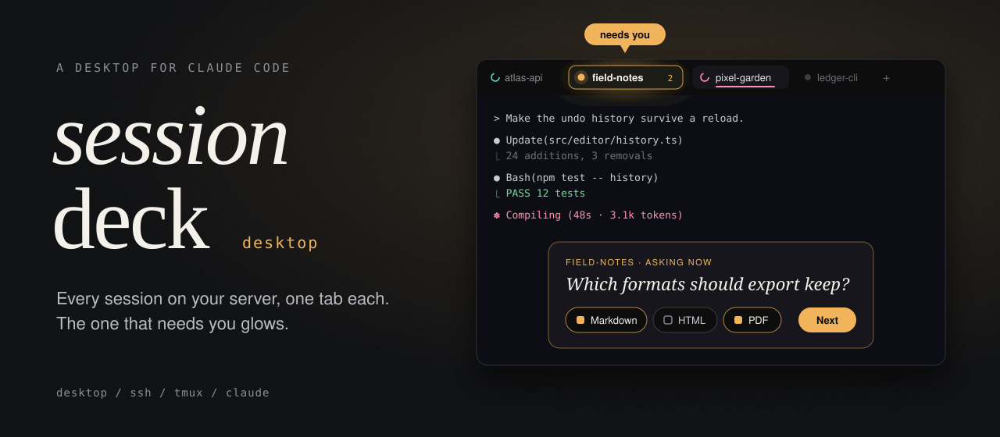
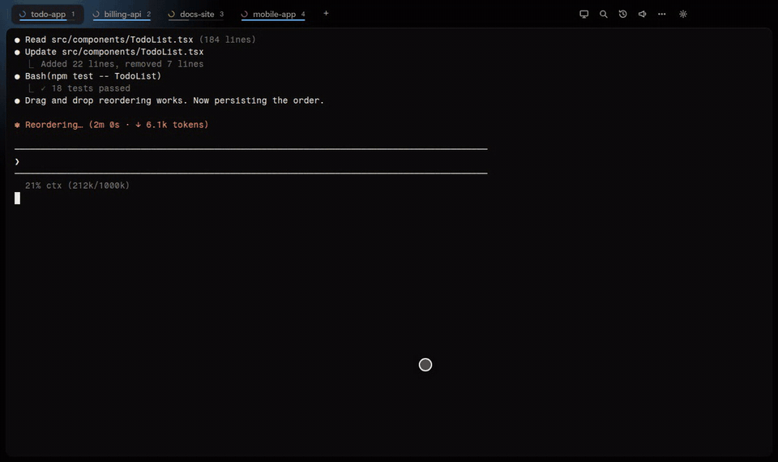
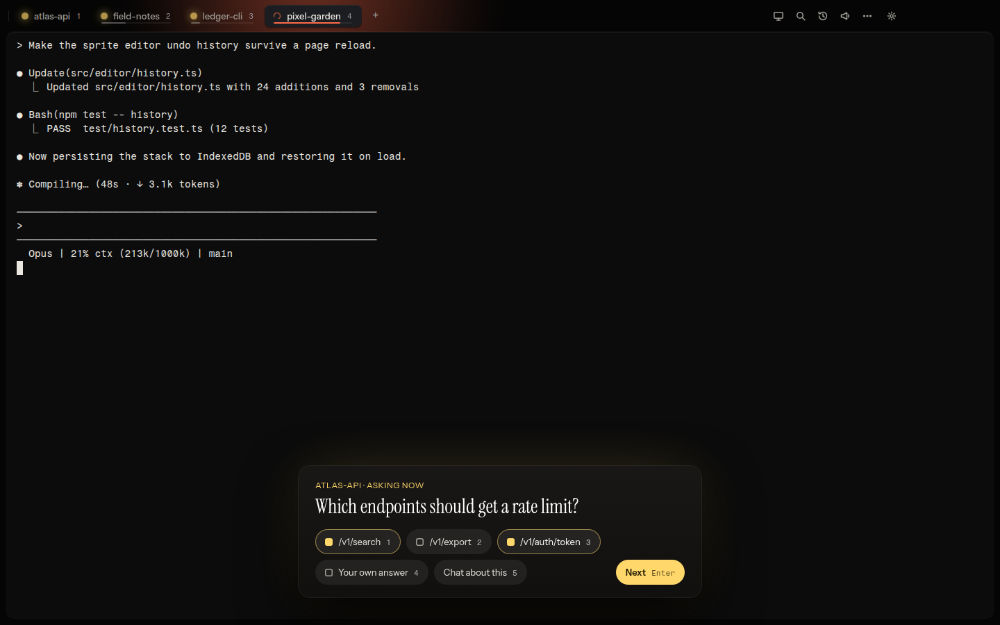
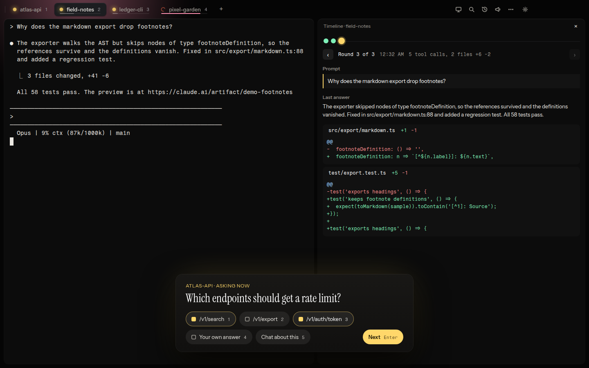
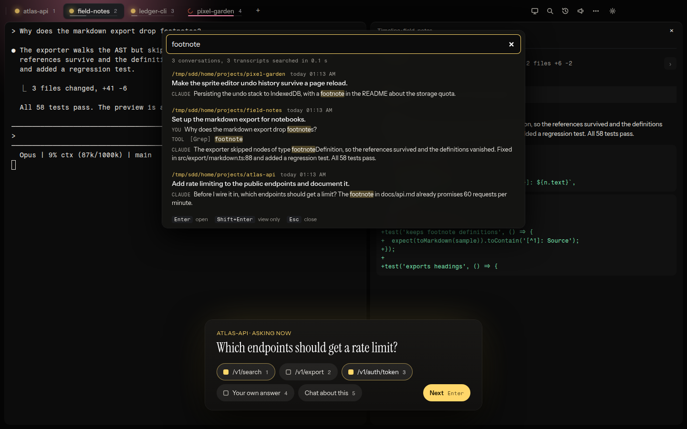
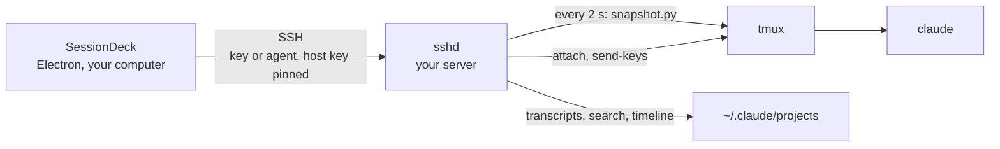
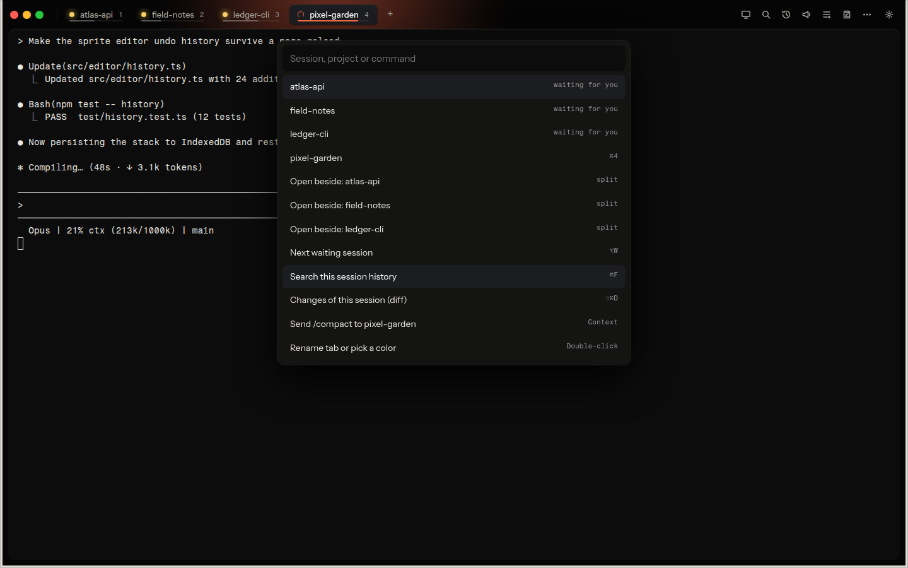
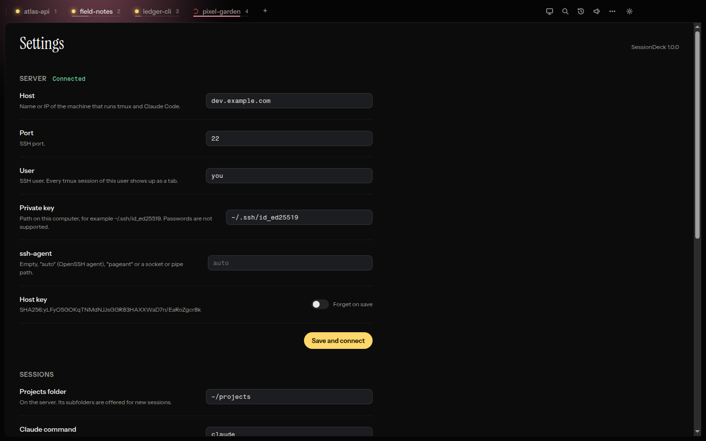

<p align="center">
  
</p>

<p align="center">
  <b>Every Claude Code session on your server, in one desktop window.</b><br>
  SessionDeck connects over SSH, gives each tmux session its own tab with a real terminal,
  lights up the tab that is waiting for you, and lets you answer Claude's questions from a card.
</p>

<p align="center">
  
</p>

<p align="center">
  <a href="#install">Install</a> ·
  <a href="#how-it-works">How it works</a> ·
  <a href="#server-setup">Server setup</a> ·
  <a href="#configuration">Configuration</a> ·
  <a href="#security">Security</a> ·
  <a href="#faq">FAQ</a> ·
  <a href="CHANGELOG.md">Changelog</a> ·
  <a href="https://github.com/crizex/sessiondeck-desktop/releases">Releases</a>
</p>

---

## Why

Running Claude Code on a server is the right call for long tasks: the laptop can sleep and the work goes on.
But now there are five sessions in five SSH windows, and none of them tells you when it is done,
when it is stuck on a permission prompt, or when it has been waiting for an answer for twenty minutes.

**SessionDeck is a desktop app for exactly that.** One window, one tab per session. The tab that
needs you glows, a notification tells you which one it is, and its question shows up as a card
you can answer without hunting for the right terminal.

<p align="center">
  
</p>

## What you get

| | |
|---|---|
| **A tab per session** | Every tmux session of your SSH user becomes a tab with a full xterm.js terminal. State at a glance: spinner for working, a glowing dot for waiting for you, a context bar that turns warm and hot as the window fills. Drag a tab onto the terminal to split two sessions side by side, drag it back onto the tab bar or click × to close the split. Rename tabs, give them colors. |
| **Question cards** | When Claude asks (a choice, a permission prompt, a multi-select question with checkboxes), the options appear on a card over whatever you are doing. Click or press the number; SessionDeck moves the cursor in the session for you. Several open questions queue up. |
| **Notifications** | "atlas-api is asking", "field-notes is done". Only for tabs you are not looking at, and only once the state is stable, so no noise between two tool calls. `Alt+W` jumps to the next waiting session. |
| **Search across sessions** | `Ctrl+Shift+F` searches all Claude transcripts of the last 30 days: your prompts and Claude's answers, with the hit marked. Enter jumps into the running session or resumes the conversation in a new tab. `Ctrl+F` searches the full history of the current session, not just the scrollback. |
| **Timeline** | `Ctrl+Shift+Z` shows every round of a session as a dot: the prompt, the last answer, how many tools ran and every file edit as a diff. |
| **Live preview** | `Ctrl+Shift+L` shows the web page the session is building, desktop and phone side by side, and reloads it as soon as a file in the project changes. A click on the size below the phone cycles through phone, foldable closed and foldable open (with the crease). If the session last wrote an HTML file, that draft shows up without any setup. `localhost` addresses on the server are tunneled over SSH. |
| **Preview panel** | File paths, images, diffs and claude.ai artifact links in the terminal are clickable and open next to the session, with syntax highlighting. `Ctrl+Shift+D` shows the uncommitted changes this session made, even when several sessions share a folder. "Ask to commit" queues a commit prompt for the session. |
| **Prompt queue** | `Ctrl+Shift+Q` lines up the next prompts for a session. They go out one at a time as soon as it is done, never into a running turn or an open question. The tab shows how many are waiting. "To next free" hands a prompt to whichever session in the folder has time first; if none is free after two minutes, SessionDeck starts a new one for it. |
| **Recap** | `Ctrl+Shift+B` sums up what a session did: duration, prompts, tool calls, tokens, its commits, the files it changed with +/- and what is not committed yet. A short version shows up when you end a session. |
| **Messages between sessions** | When sessions talk to each other (`SendMessage`), the speech bubble button shows the conversation of the current session: what came in from whom, what went out, newest on top. |
| **5-hour limit** | Your Claude.ai usage at the top right, warm from 70 %, hot from 90 %, with the reset time and the weekly share. The optional limit pause stops every working session at a percent you choose and sends it on after the reset, so nothing breaks off in the middle of an edit. Also by hand, from the same menu. |
| **Templates** | "folder \| prompt" lines in the settings show up on top of the `+` menu. One click starts a session there and sends the prompt once Claude is ready. |
| **Broadcast** | `Ctrl+Shift+R` sends one message ("run the tests", "commit and push") to several sessions at once. Snippets are configurable. |
| **Command palette** | `Ctrl+K` for everything, with fuzzy search. `Ctrl+Alt+C` brings the window forward from anywhere. |
| **Voice input** | Optional and off by default: dictate into the prompt with `Ctrl+M`, recognized on your own server with faster-whisper. |
| **Updates** | The Windows installer and the macOS app update themselves from this repository's GitHub Releases, with the SHA-512 checked before anything runs. |

<p align="center">
  
</p>

<p align="center">
  
</p>

## How it works



- **tmux is the source of truth.** Every tmux session of the SSH user is a tab. New sessions from the
  app are tmux sessions running `claude` in a login shell in the chosen project folder.
- **One SSH connection** for terminals (`tmux attach`), keys (`tmux send-keys`), the small
  Python helpers in [`server/`](server) (sent inline with `python3 -c`, nothing to install for the
  basics), SFTP for dropped files and image previews. Only the live preview opens a second one for its tunnel.
- **State from the screen.** Every 2 seconds the app captures each pane and reads it: a spinner line
  means working, a numbered menu means a question, a changed screen means activity. The status line
  gives the context usage.
- **History from the transcripts** Claude Code already writes to `~/.claude/projects`. Nothing extra is logged.
- **Nothing leaves your machines.** The app talks to your server and, for updates, to the GitHub Releases
  API of this repository. That is all.

## Install

### Windows: installer

Download `SessionDeck-Setup-<version>.exe` from the
[releases page](https://github.com/crizex/sessiondeck-desktop/releases) and run it. It installs per user,
without admin rights, and keeps itself up to date from new releases.

The installer is not code signed, so Windows SmartScreen asks once ("More info", then "Run anyway").
If you prefer, build it yourself from source.

### macOS: app

Download the archive for your Mac from the [releases page](https://github.com/crizex/sessiondeck-desktop/releases):
`SessionDeck-<version>-mac-arm64.tar.gz` for Apple silicon (M1 and newer), `-mac-x64.tar.gz` for Intel.
Double-click it and drag `SessionDeck.app` into Applications. The app updates itself from new releases:
after quitting, it swaps the `.app` and opens the new version.

The app is signed ad hoc, not with an Apple Developer ID, so Gatekeeper blocks the first start.
Open it once, then allow it under System Settings > Privacy & Security > "Open Anyway"
(on macOS 14 and older: right-click the app, "Open"). Updates don't ask again.

Shortcuts use `⌘` where Windows uses `Ctrl` (`⌘K`, `⌘1`, `⇧⌘F`); the palette and tooltips show the Mac keys.
`Ctrl+Tab` stays, because `⌘Tab` belongs to macOS.

<p align="center">
  
</p>

### From source (Windows, macOS, Linux)

Requirements: [Node.js](https://nodejs.org) 20 or newer and git.

```bash
git clone https://github.com/crizex/sessiondeck-desktop
cd sessiondeck-desktop
npm install
npm start
```

Build the Windows installer yourself (on Windows):

```bash
npm run build      # dist/SessionDeck-Setup-<version>.exe
```

Build the macOS app (on a Mac, or on Linux with [rcodesign](https://github.com/indygreg/apple-platform-rs) for the ad hoc signature):

```bash
npm run build-mac  # dist/SessionDeck-<version>-mac-arm64.tar.gz and -mac-x64.tar.gz
```

On Linux, `npm start` runs the app as is. The self-updater only works in the installed app
(Windows, macOS); from source you update with `git pull`.

## Server setup

The server is any Linux machine you can reach over SSH. It needs:

| What | Why |
|---|---|
| `tmux` | Holds the sessions. Every tmux session of the SSH user becomes a tab. |
| `python3` | Runs the helpers in `server/`. Standard library only. |
| [Claude Code](https://docs.anthropic.com/en/docs/claude-code) | Installed and logged in for the SSH user. |
| `git` | Optional, for the diff view. |

That is enough. The helpers are sent with each call, so there is nothing to copy for the basics.
Optional extras:

**Context bar.** SessionDeck reads the context usage from Claude Code's status line. Any status line that
prints `NN% ctx (NNk/NNNk)` works; [`server/statusline.sh`](server/statusline.sh) does exactly that (needs `jq`):

```bash
scp server/statusline.sh you@your-server:~/.claude/statusline.sh
ssh you@your-server 'chmod +x ~/.claude/statusline.sh'
# then in ~/.claude/settings.json on the server:
#   "statusLine": { "type": "command", "command": "~/.claude/statusline.sh" }
```

The same status line also keeps your 5-hour and weekly usage in `~/.claude/sessiondeck-usage.json`
(Claude.ai subscriptions only, read from the data Claude Code already has, no extra API calls). That file feeds the
limit display at the top right. Without it, the display stays hidden. If you keep your own status line, copy the
line that writes this file into it.

**Voice input.** Speech recognition runs on your server with
[faster-whisper](https://github.com/SYSTRAN/faster-whisper) as a small systemd service without network access,
behind a unix socket that only the SSH user can reach. Install it as root:

```bash
scp -r server/voice root@your-server:/tmp/sessiondeck-voice
ssh root@your-server 'sh /tmp/sessiondeck-voice/install.sh you'
```

Then turn on "Voice input" in the settings. Without it, the microphone button does not appear at all.

**Web view of the same sessions.** The companion project
**[sessiondeck](https://github.com/crizex/sessiondeck)** runs on the server and shows the same tmux
sessions as cards in any browser, including your phone. Both work on their own and side by side;
set its address as "Web page" in the settings to open it in a tab here (`Ctrl+0`).

## Configuration

Everything is set in the app under Settings (`Ctrl+,`) and stored in `settings.json` in the app's
data folder (`%APPDATA%\SessionDeck` on Windows, `~/Library/Application Support/SessionDeck` on macOS). [`settings.example.json`](settings.example.json)
shows every field.

<p align="center">
  
</p>

| Setting | Default | What it does |
|---|---|---|
| Host, Port | empty, `22` | Your server. |
| User | empty | The SSH user. Its tmux sessions become tabs, and Claude Code runs as this user. |
| Private key | empty | Path to an OpenSSH private key on your computer, for example `~/.ssh/id_ed25519`. |
| ssh-agent | empty (auto) | Use a running agent instead: empty for the OpenSSH agent, `pageant` for PuTTY's, or a socket or pipe path. |
| Host key | pinned on first connect | The server's fingerprint. "Forget on save" pins it again, for example after a reinstall. |
| Projects folder | `~` | On the server. Its subfolders are offered when you start a new session. |
| Claude command | `claude` | What a new session runs, for example `claude --model opus`. |
| Web page | empty | Optional page for the web tab, for example your sessiondeck URL. |
| Notifications | on | Desktop notifications for waiting sessions. |
| Voice input | off | Needs the voice service on the server, see above. |
| Font size | `14` | Terminal font size. |
| Snippets | three examples | Quick texts for broadcast. |
| Commit prompt | `commit and push` | What "Ask to commit" in the diff view queues, for example `commit, push and deploy`. |
| Templates | empty | One per line, `folder \| prompt`, for example `api \| run the tests and fix what fails`. |
| Recap when ending | on | Short recap in the End dialog. |
| Limit pause | `0` (off) | At this share of the 5-hour limit, working sessions stop (Escape, background agents too) and get a note to continue once the limit has reset. Needs the status line above. Runs while the app is open; for a pause that also works with the app closed, use it in sessiondeck on the server instead and leave this at `0`. |

For several profiles side by side, or tests, start the app with `SESSIONDECK_DATA=<folder>` to use
a different data folder.

## Keyboard

| Keys | Action |
|---|---|
| `Ctrl+K` | Command palette |
| `Ctrl+1` to `Ctrl+9`, `Ctrl+Tab` | Switch tabs |
| `Ctrl+Shift+1` to `Ctrl+Shift+9` | Open that session in a split next to the current one |
| `Alt+W` | Next waiting session |
| `1` to `9` on a focused question card | Pick that option, `Esc` puts the card away |
| `Ctrl+F` | Search the history of this session |
| `Ctrl+Shift+F` | Search all sessions |
| `Ctrl+Shift+Z` | Timeline |
| `Ctrl+Shift+L` | Live preview |
| `Ctrl+Shift+D` | Changes of this session (diff) |
| `Ctrl+Shift+Q` | Prompt queue |
| `Ctrl+Shift+B` | Recap of the session |
| `Ctrl+Shift+R` | Broadcast |
| `Ctrl+M` | Voice input (when enabled) |
| `Ctrl+0` | Web page tab |
| `Ctrl+,` | Settings |
| `Ctrl+Alt+C` | Bring SessionDeck to the front (global) |

On macOS, read `⌘` for `Ctrl` (`Ctrl+Tab` and the global `⌃⌥C` stay as they are).

## Security

SessionDeck is an SSH client with a terminal. It can do on your server exactly what the SSH user can do.

- **Keys only.** Authentication is by private key or ssh-agent. There is no password field, and nothing
  secret is written to `settings.json`: it holds the key's path, never the key.
- **Pinned host key.** The server's host key is stored on the first connection (trust on first use)
  and checked on every connection after that. A changed key stops the connection with a clear message
  instead of silently continuing.
- **No shell injection.** Everything that reaches the server is quoted as POSIX shell arguments; session
  names, paths and search terms never become commands.
- **Locked-down renderer.** The UI runs with context isolation, sandbox and no Node.js integration.
  It can only call a fixed list of IPC channels. Embedded pages are limited to your web page,
  claude.ai artifact previews and the live preview.
- **Private settings file,** written with mode 0600.
- **Checked updates.** The updater only downloads from this repository's GitHub Releases and verifies
  the SHA-512 from `latest.yml` before running the installer.
- **Voice stays on your server.** Audio goes over SSH to a unix socket on your server, readable only
  by the SSH user. No cloud speech service.

Worth knowing:

- Use a dedicated key, ideally with a passphrase in an agent, and a normal (non-root) SSH user.
- State detection reads the screen. A future Claude Code release that changes its layout can make a
  tab show the wrong state until the patterns in `state.js` are updated.

Found a security issue? Please open a private security advisory on GitHub instead of a public issue.

## Development

```bash
npm install
npm test          # node:test, no extra framework
npm start
```

The code is small on purpose:

| File | What it does |
|---|---|
| `main.js` | Electron main process: window, settings, polling, IPC |
| `connection.js` | The SSH connection (ssh2): reconnects, host key pinning, SFTP, quoting |
| `state.js` | Pure logic, shared with the UI: reading Claude's screen, states, notifications, question card |
| `updater.js` | Updates from GitHub Releases |
| `main/` | Main-process parts of live preview, search, timeline, queue, recap and voice |
| `ui/` | The window: plain HTML, CSS and scripts, no build step |
| `server/` | Python helpers that run on the server |

Runtime dependencies: `ssh2`, `@xterm/xterm` with two addons, and `highlight.js`.

## FAQ

**Does this use the Claude API or my API key?**
No. It runs the regular `claude` CLI on your server, logged in however you logged it in. SessionDeck
itself makes no calls to Anthropic.

**Do I need the sessiondeck server app?**
No. SSH, tmux, python3 and Claude Code are enough. [sessiondeck](https://github.com/crizex/sessiondeck)
is the browser counterpart, for your phone or any machine without the desktop app.

**Can I still attach from a normal terminal?**
Yes. They are ordinary tmux sessions. `tmux attach -t <name>` works while the tab is open.

**What happens when my laptop sleeps or the network drops?**
The sessions keep running in tmux. SessionDeck reconnects with a backoff and the tabs come back as they were.

**Why does it only show my own sessions?**
tmux sessions belong to a user. SessionDeck sees the sessions of the SSH user it logs in as.

**Does it work with password logins?**
No, on purpose. Use a key, or an ssh-agent (including Pageant on Windows).

**macOS and Linux?**
macOS has a ready-made app (see Install), Linux runs from source (`npm start`).

## Changelog

What changed in each version is in [CHANGELOG.md](CHANGELOG.md), downloads are on the
[releases page](https://github.com/crizex/sessiondeck-desktop/releases).

## License

MIT, see [LICENSE](LICENSE). The fonts in `ui/fonts` (Instrument Sans, Instrument Serif, Fragment Mono)
are licensed under the SIL Open Font License; the license texts are next to them.

Not affiliated with Anthropic. Claude is a trademark of Anthropic.
